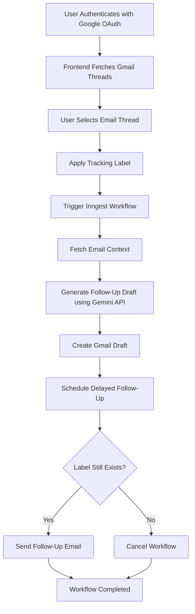

# AI Follow Up

AI Follow Up is an event-driven email automation platform that generates and schedules AI-powered follow-up drafts for Gmail conversations.

The application integrates Gmail APIs, AI-generated contextual responses, and background workflow orchestration to automate follow-up communication while giving users full control over draft management.

---

## Features

* Google OAuth-based authentication
* AI-generated follow-up email drafts
* Delayed email scheduling using Inngest workflows
* Gmail label-based tracking system
* Draft deletion and workflow cancellation
* Event-driven background processing

---

## Workflow

1. User authenticates with Google OAuth.
2. Emails are selected and tracked using labels.
3. AI-generated follow-up drafts are created contextually.
4. Background workflows schedule follow-up emails after a defined delay.
5. Users can cancel follow-ups by deleting drafts or removing labels.

---

## Workflow Architecture



---

## Architecture

### Frontend

* React
* Vite
* Tailwind CSS

### Backend

* Node.js
* Express.js
* MongoDB + Mongoose

### Workflow & Automation

* Inngest
* @inngest/agent-kit

### Integrations

* Gmail API
* Google OAuth
* Gemini API

---

## Engineering Challenges

Some key engineering challenges solved in this project include:

* Managing delayed background workflows reliably
* Designing AI prompts for contextual follow-up generation
* Preventing duplicate follow-up processing
* Handling Gmail API authentication and permissions
* Building event-driven workflow orchestration using Inngest

---

## Local Setup

### Clone the repository

```bash
git clone https://github.com/guglanisuvid/AI-Follow-Up.git
```

### Install dependencies

Install dependencies separately inside the `client` and `server` folders:

```bash
npm install
```

### Configure Environment Variables

#### Server `.env`

```env
PORT=
VITE_APP_URL=
MONGO_URI=
GOOGLE_CLIENT_ID=
GOOGLE_CLIENT_SECRET=
GOOGLE_REDIRECT_URI=
GEMINI_API_KEY=
JWT_SECRET=
JWT_EXPIRATION=
```

#### Client `.env`

```env
VITE_API_URL=
```

### Run the application

#### Client

```bash
npm run dev
```

#### Server

```bash
npm run inngest-dev
npm run dev
```

---

## Future Improvements

* Configurable follow-up timing
* Multi-email thread support
* AI personalization controls
* Analytics for follow-up performance
* Dockerized deployment

---

## License

MIT License
